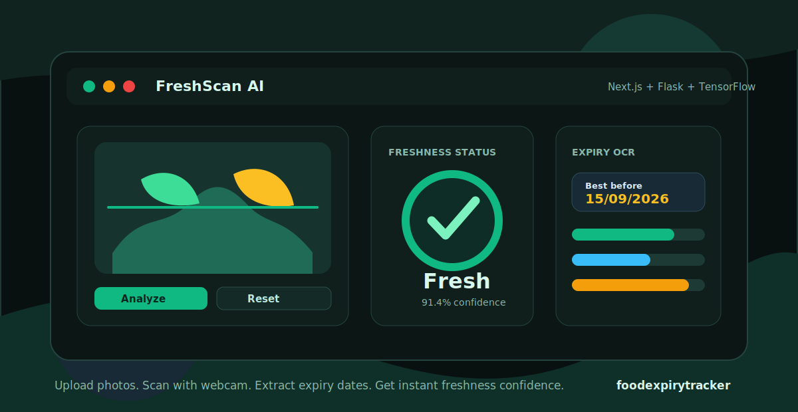
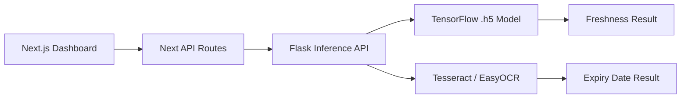

<p align="center">
  
</p>

<h1 align="center">FreshScan AI</h1>

<p align="center">
  Food freshness detection, webcam scanning, and expiry-label OCR in one modern dashboard.
</p>

<p align="center">
  <a href="https://nextjs.org/"></a>
  <a href="https://react.dev/"></a>
  <a href="https://www.tensorflow.org/"></a>
  <a href="https://flask.palletsprojects.com/"></a>
</p>

<p align="center">
  <a href="https://github.com/Deepak-Moger/foodexpirytracker/actions/workflows/ci.yml"></a>
  
  
  
  
</p>

<p align="center">
  
</p>

---

## Overview

FreshScan AI is a full-stack freshness dashboard for checking food images and product labels. The frontend is a polished Next.js app; the backend is a Flask inference service that loads the bundled TensorFlow model from `models/food_expiry_model.h5`.

The app supports three practical workflows:

| Workflow | What It Does | Endpoint |
| --- | --- | --- |
| Upload scan | Predicts whether a food image is fresh or spoiled | `POST /api/analyze` |
| Webcam scan | Captures a camera frame and uses the same model path | `POST /api/predict_webcam` |
| Label OCR | Extracts product-label text and detects expiry dates | `POST /api/upload` |

## Highlights

- Real TensorFlow/Keras inference with the checked-in `.h5` model.
- Corrected binary sigmoid label mapping: class `0` is `Fresh`, class `1` is `Spoiled`.
- Webcam and upload flows share the same preprocessing and prediction pipeline.
- OCR uses Tesseract when available and falls back to EasyOCR.
- Session scan history, confidence gauge, dark/light theme, and responsive UI.
- Next.js API routes proxy browser requests to Flask, keeping the client simple.

## Architecture



## Tech Stack

| Layer | Tools |
| --- | --- |
| Frontend | Next.js 16, React 19, TypeScript, Tailwind CSS |
| UI | shadcn-style components, Radix UI, Framer Motion, Lucide icons |
| Backend | Flask, Flask-CORS, Werkzeug |
| ML | TensorFlow/Keras, NumPy, Pillow |
| OCR | pytesseract, EasyOCR |
| Dev tooling | npm, Git LFS, TypeScript, GitHub Actions |

## Quick Start

### Prerequisites

- Node.js 20+
- Python 3.12
- npm
- Git LFS for pulling the bundled model file

### 1. Clone

```bash
git clone https://github.com/Deepak-Moger/foodexpirytracker.git
cd foodexpirytracker
```

If Git LFS is not already enabled on your machine, install it before cloning or run:

```bash
git lfs install
git lfs pull
```

### 2. Configure Environment

```bash
cp .env.example .env.local
```

Default local values:

```env
NEXT_PUBLIC_API_URL=/api
PYTHON_API_URL=http://localhost:5000
MODEL_THRESHOLD=0.5
MODEL_NEGATIVE_LABEL=Fresh
MODEL_POSITIVE_LABEL=Spoiled
OCR_TIMEOUT_SECONDS=10
```

### 3. Install Dependencies

```bash
npm install
python -m pip install -r requirements.txt
```

### 4. Run The App

```bash
npm run dev:full
```

Open `http://localhost:3000`.

## Free Online Deployment

Use a Hugging Face Docker Space for the full app. The Space runs Flask internally on port `5000` and exposes the Next.js dashboard on port `7860`.

1. Create a Hugging Face Space:
   - SDK: `Docker`
   - Visibility: `Public`
   - Hardware: `CPU Basic`
2. Add the Space remote:

```bash
git remote add hf https://huggingface.co/spaces/YOUR_USERNAME/freshscan-ai
```

3. Push the app:

```bash
git push hf main
```

Free Spaces can sleep after inactivity, so the first request after a quiet period may take time to wake up.

## Scripts

| Command | Purpose |
| --- | --- |
| `npm run dev` | Start the Next.js frontend |
| `npm run dev:backend` | Start the Flask backend on port `5000` |
| `npm run dev:full` | Start frontend and backend together |
| `npm run start:hf` | Production start command used by the Hugging Face Docker image |
| `npm run typecheck` | Run TypeScript validation |
| `npm run check` | Run TypeScript validation and backend syntax check |
| `npm run build` | Build the Next.js app |

## API Reference

### `GET /health`

Returns backend health, model path, model input size, label mapping, and OCR engine availability.

### `POST /api/analyze`

Accepts `multipart/form-data` with a `file` field.

```json
{
  "success": true,
  "data": {
    "label": "Fresh",
    "confidence": 91.4,
    "raw_score": 0.086,
    "threshold": 0.5
  }
}
```

### `POST /api/predict_webcam`

Accepts a base64 camera image.

```json
{
  "image": "data:image/jpeg;base64,..."
}
```

### `POST /api/upload`

Accepts `multipart/form-data` with a product-label image and returns extracted text plus expiry-date details when found.

## Model Notes

The bundled model is a binary sigmoid classifier with `150x150x3` input. Because the H5 file does not include class-name metadata, label polarity is controlled by environment variables:

```env
MODEL_THRESHOLD=0.5
MODEL_NEGATIVE_LABEL=Fresh
MODEL_POSITIVE_LABEL=Spoiled
```

Scores below the threshold are treated as class `0` (`Fresh`). Scores at or above the threshold are treated as class `1` (`Spoiled`). If you retrain with a different class order, swap `MODEL_NEGATIVE_LABEL` and `MODEL_POSITIVE_LABEL`.

## Repository Quality

- Git LFS tracks the TensorFlow model file.
- `.env.example` documents local configuration without committing secrets.
- GitHub Actions validates TypeScript and Python syntax on pushes and pull requests.
- The frontend talks to Flask through Next API routes, so deployment targets can override `PYTHON_API_URL` without changing browser code.

## Verification

Run these before opening a pull request:

```bash
npm run check
npm run build
```

For backend-only smoke testing:

```bash
python app.py
curl http://localhost:5000/health
```

## Project Structure

```text
.
|-- app/                  # Next.js pages and API proxy routes
|-- components/           # UI components and dashboard widgets
|-- hooks/                # Shared React hooks
|-- lib/                  # Frontend utilities
|-- models/               # TensorFlow model tracked with Git LFS
|-- public/               # Icons and static assets
|-- app.py                # Flask backend, model inference, OCR, health route
|-- requirements.txt      # Python dependencies
|-- package.json          # Frontend scripts and dependencies
`-- README.md
```

## Notes

- First EasyOCR use can be slow because OCR models are initialized lazily.
- A system Tesseract install is optional; EasyOCR is used when Tesseract is unavailable.
- If Flask is down or the model fails to load, API calls return errors instead of mock predictions.
